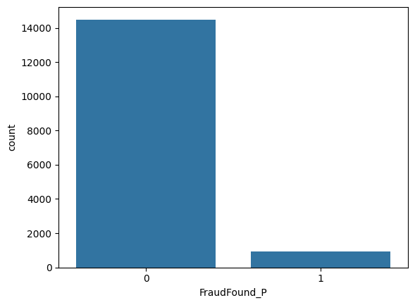
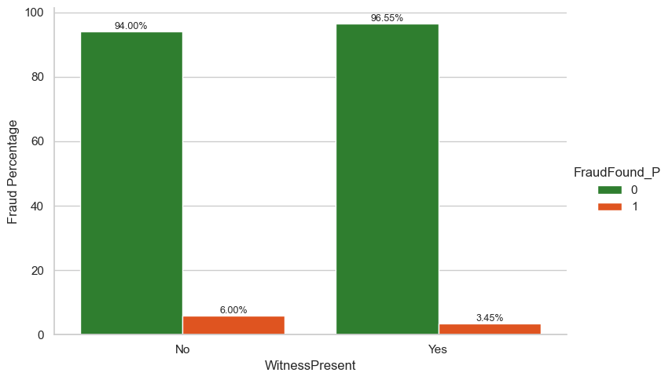
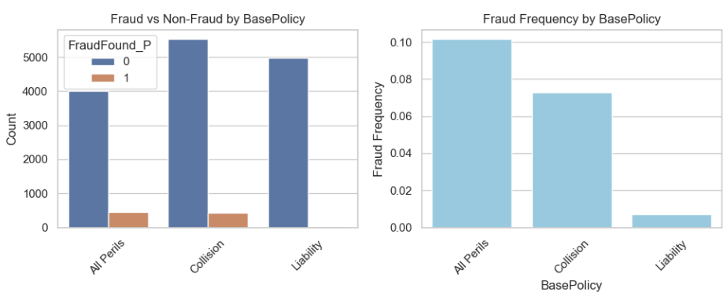
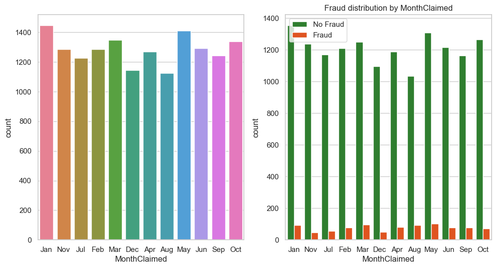
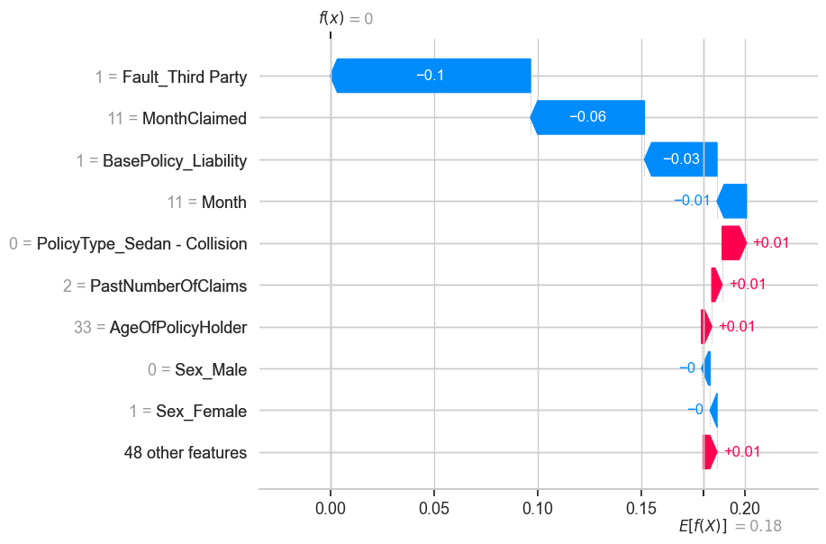
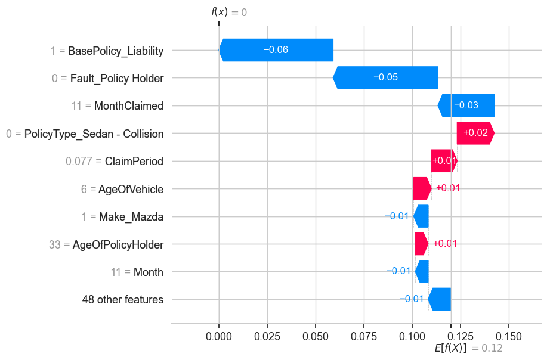
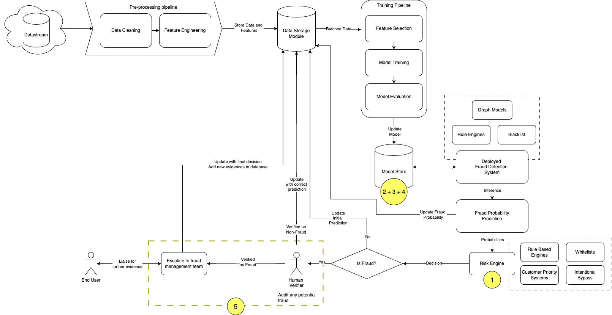

# dsa4263-fraud-detection
Hackathon for Fraud Detection

**DSA4263 Group 7:**
- Austin Loh
- Daniel Lee
- Eric Wen
- Nadine Gan

# Table of contents

- [Background](#Background)
- [Objective](#Objective)
- [Project Organization](#Project-Organization)
- [Running the Project](#Running-the-Project)
- [The Data](#The-Data)
- [Project Methodology](#Project-Methodology)
    - [Exploratory Analysis](#Exploratary-Analysis)
    - [Data Preparation](#Data-Preparation)
    - [Models](#Models)
- [Results](#Results)
    - [Model Comparison](#Model-Comparison)
    - [Model Explainability](#Model-Explanability)
    - [Model Deployment Considerations](#Model-Deployment-Consideration)
    - [Model Deployment Architecture](#Model-Deployment-Architecture)

## Background

Fraud in vehicle insurance claims is significant to the insurance industries. This is because fraudulent claims could result in substantial monetary losses to insurance companies when insurance claimants conspire to make fake or dishonest claims involving property damage or injuries from accidents, with the intention to receive greater coverage or claim amounts.

## Objective

Our team aims to detect whether a vehicle insurance claim application is fraudulent or not.

## Project Organization
------------

    ├── LICENSE
    ├── README.md          <- The top-level README for developers using this project.
    ├── data
    │   ├── processed      <- The intermediate data after feature engineering.
    │   ├── raw            <- The original, immutable data dump.
    │   └── sampling       <- The final data for modelling after encoding, scaling and sampling.
    │
    ├── models             <- Trained and serialized models, model predictions, or model summaries
    │
    ├── notebooks          <- Jupyter notebooks.
    │
    ├── references         <- Data dictionaries, manuals, and all other explanatory materials.
    │
    ├── figures            <- Generated graphics and figures to be used in reporting
    │   └── eda            <- Generated analysis as HTML, PDF, LaTeX, etc.
    │
    └── requirements.txt   <- The requirements file for reproducing the analysis environment, e.g.
                              generated with `pip freeze > requirements.txt`

## Running the Project
Simply run all cells in the [main notebook](./main.ipynb)

## The Data

The dataset used were obtained from the [Kaggle](https://www.kaggle.com/datasets/shivamb/vehicle-claim-fraud-detection/data) website.

A data dictionary has been provided [here](./datadictionary.txt)

## Project Methodology

### Exploratory Analysis
||
|:--:|
|Figure 1: Highly imbalanced dataset, with fraud occuring less than non-fraud|

||
|:--:|
|Figure 2: More fradulent claims are made when no witness are present|

||
|:--:|
|Figure 3: Fradulent claims based on base insurance policy|

||
|:--:|
|Figure 4: More incidents are reported in the months of Jan and May|

### Data Preparation
1) **Cleaning of data**

| Feature      | Issue                      | Processing Steps        |
|--------------|----------------------------|-------------------------|
| DayOfWeekClaimed | Entry is “0”, while the rest of the records are strings representing days of the week (eg. “Mon”, “Tue”) | Removal of record from dataset |
| Age | Large number of records are “0”, which is not logical since this feature represents age of the person. | Impute Age == 0 with the mean Age. Introduce a flag for entries which originally had Age == 0. A binary variable, “AgeUnknown” is created. If Age is 0, AgeUnknownwill be 1, else it will be 0. |

2) **Feature Engineering**

| Feature      | Hypothesis                 | How it was created      |
|--------------|----------------------------|-------------------------|
| Claim Period | Fraudsters may delay submitting claims for longer periods, so that they can evade checks by insurance companies or allow themselves more time to create fake evidence. | MonthClaimed * 30 + WeekOfMonthClaimed * 7 + DayOfWeekClaimed - (Month * 30 + WeekOfMonth * 7 + DayOfWeek) |
| PolicyAndVehicle | Vehicle price may have an interaction effect on the choice of base policy purchased | Concatenate BasePolicy and VehiclePrice. Then one hot encode this new feature. |

3) **Statistical Tests**
    - For categorical features, we used the Chi-Square test to determine its association with FraudFound_P. 
    - Cramer's V was then used to determine the strength of the association of the column with FraudFound_P.
    - Feature selection was done based on whether the column was statistically significant based on the Chi-Square test at alpha = 0.05.

4) **Scaling and Encoding**
    - StandardScaler was used to scale numerical features.
    - For ordered categorical features, OrdinalEncoder was used.
    - For categorical features with no order, OneHotEncoder was used.

5) **Resampling of train data**
    - Due to the imbalance of our datasets, we decided to oversample the minority class using SMOTE.
    - An alternative method of sampling was also done using a combination of SMOTE and Tomek Links.

### Models

- **Baseline Models:**
    - **Logistic Regression (LR):**
        - *Simplicity:* It is a straightforward, linear model that is easy to implement and interpret.
        - *Interpretability:* The coefficients of the model can be directly interpreted as the log odds of the outcome, providing clear insights into the relationship between features and the likelihood of fraudulent claims.
        - *Binary Classification:* It is usually well-suited for binary classification tasks like predicting if an insurance claim is fradulent.

    - **Support Vector Machine (SVM):**
        - *Possible Effectiveness in High-dimensional Spaces:* SVM is particularly effective when the number of features is large compared to the number of samples.

- **Challenger Models:**
    - **Naive Bayes (NB):**
        - *Simple:* Easy to implement and understand.
        - *Works Well with High Dimensional Data:* Works well even when assumption of independence among features is violated.
    - **Decision Tree (DT):**
        - *Interpretability:* Decision trees are easy to understand and visualize, making them useful for explaining the decision-making process to non-technical stakeholders.
        - *Ease of Visualization:* The tree structure can be easily visualized, providing a clear representation of the decision rules.
        - *Handling of Non-linear Relationships:* Decision trees can capture non-linear relationships, although they are more prone to overfitting.

    - **Random Forest (RF):**
        - *Ability to Handle Non-linear Relationships:* Random Forest is an ensemble method that combines multiple decision trees, making it capable of capturing complex, non-linear relationships in the data.
        - *Feature Importance Analysis & Intepretability:* It provides insights into which features are most influential in predicting the outcome, which is valuable for understanding the factors contributing to predicting a claim as fradulent.

    - **XGBoost:**
        - *Handles Complex Relationships:* Can capture complex relationships in data
        - *Feature Importance Analysis:* Provides feature importance scores, allowing insights into which features are the most influential in making predictions.

- **Finetuning of models:**
    - For each model, we finetune their hyperparameters using grid search with a 5 fold cross validation, with f1-score as their scoring metric. 

## Results

### Model Comparison

| Sampling | Model | Accuracy | Precision | Recall | F1 Score | ROC-AUC |
|----------|-------|----------|-----------|--------|----------|---------|
|No        | LR    |   0.62   |   0.13    |**0.94**|   0.23   |  0.808  |
|No        | SVM   |   0.75   |   0.10    |  0.39  |   0.16   |  0.646  |
|No        | NB    |   0.75   |   0.14    |  0.63  |   0.23   |  0.783  |
|No        | DT    |   0.79   |   0.15    |  0.56  |   0.24   |  0.681  |
|No        | RF    |   0.77   |   0.17    |  0.69  | **0.27** |**0.830**|
|No        |XGBoost| **0.83** | **0.18**  |  0.53  | **0.27** |  0.820  |
|SMOTE     | LR    |   0.71   |   0.13    |  0.67  |   0.21   |  0.771  |
|SMOTE     | SVM   |   0.31   |   0.07    |  0.81  |   0.12   |  0.621  |
|SMOTE     | NB    |   0.48   |   0.09    |**0.90**|   0.17   |  0.755  |
|SMOTE     | DT    |   0.83   |   0.17    |  0.48  |   0.25   |  0.724  |
|SMOTE     | RF    |   0.85   |   0.19    |  0.44  | **0.26** |**0.815**|
|SMOTE     |XGBoost| **0.91** | **0.26**  |  0.23  |   0.24   |  0.804  |
|SMOTE + Tomek| LR |   0.71   |   0.13    |  0.66  |   0.22   |  0.769  |
|SMOTE + Tomek| SVM|   0.31   |   0.07    |  0.81  |   0.12   |  0.616  |
|SMOTE + Tomek| NB |   0.47   |   0.09    |**0.90**|   0.17   |  0.754  |
|SMOTE + Tomek| DT |   0.84   |   0.17    |  0.46  | **0.25** |  0.702  |
|SMOTE + Tomek| RF |   0.85   |   0.18    |  0.42  | **0.25** |**0.817**|
|SMOTE + Tomek|XGBoost|**0.92**|**0.24**  |  0.17  |   0.20   |  0.807  |

### Model Explainability

Surprisingly, the best performing model in terms of F1 Score were RF and XGB without oversampling. To understand how our model were making their classifications, we utilised Shapley values.

||
|:--:|
|Shapley values for Random Forest|

||
|:--:|
|Shapley values for XGBoost|

### Model Deployment Consideration
1) Ability to adjust fraud risk tolerance thresholds. To account for different risk factors across locations, time periods, and other factors such as financials, we obtain the class probabilities, allowing a customized threshold to be set to flag out a claim as fradulent.

2) Model performance over real time processing speed. The company does not need to predict fraud in real time, and instead can opt for batch prediction and processing during the insurance claim process.

3) Model Explainability. Our team opted for more explainable models to gain credibility when flagging a claim report, as fradulent as accusing a customer of fraud without evidence or reason is detrimental to the customer experience. 

4) Continuous Monitoring and Deployment. Fraud patterns may change and evolve, pitting fraud detection systems in an arms race against fraudsters. By continuously monitoring and deploying better, updated models, the fraud systems stay robust in the long term for effective detection.

5) Human in the loop. Machine Learning models are not perfect, and sometimes make mistakes or lack additional contexts. This is why humans are part of the loop to manage detected potential cases in the best way possible. This means a human verifier to corroborate documents and evidence with predictions, management teams for customer communication and contact, as well as an avenue for users to appeal to a dedicated customer service if they are incorrectly flagged out.

### Model Deployment Architecture

In light of the considerations above, we are proposing the below architecture. 
